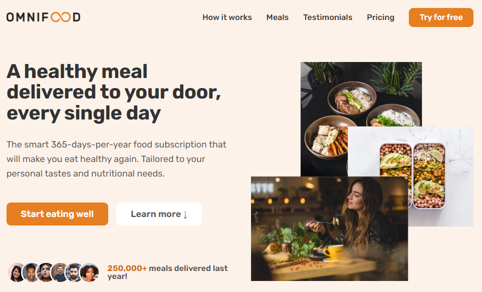

# Omnifood

This is a single-page website for meal ordering, which was created as the final project for an HTML/CSS course. It allows users to select their preferred meals using an intuitive interface, and then place an order for delivery. The website is designed to be responsive and accessible, ensuring a seamless user experience.

# Key featuers

- Hamburger menu for tablet-sized screens and smaller
- Smooth scrolling for navigation links
- IntersectionObserver-triggered animations
- Cross-browser compatibility for CSS styles
- Consistent styling of select input
- Functional order form
- Fully responsive design using media queries
- Layout built with CSS Grid, Flexbox, and Absolute positioning

# Project image

